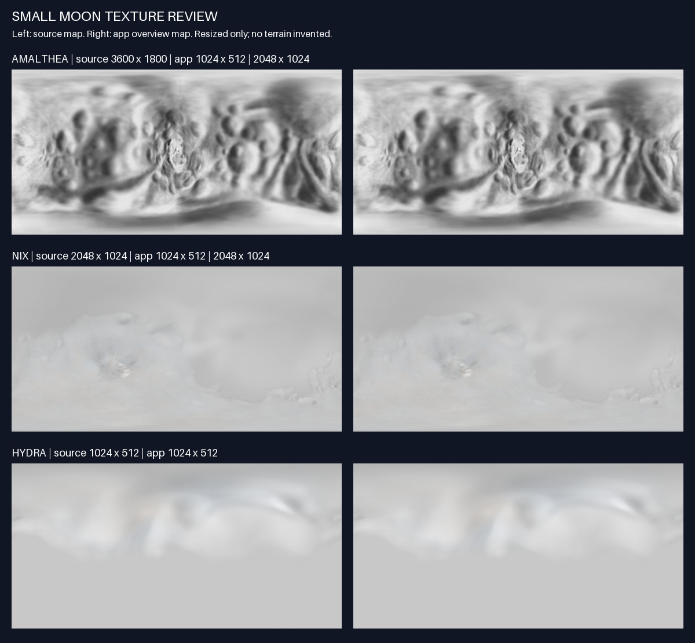

# Amalthea, Nix and Hydra imagery

Reviewed and prepared on 2026-09-28. These three moons previously had no surface map and rendered as flat colored spheres. None of these maps is a complete photographic globe. Each has different limitations, described below.



## Sources and attribution

| Body | Source | Creator / credit | Terms | Source dimensions | App dimensions |
| --- | --- | --- | --- | --- | --- |
| Amalthea | [Stooke Small Bodies Maps V2.0](https://sbnarchive.psi.edu/pds3/multi_mission/MULTI_SA_MULTI_6_STOOKEMAPS_V2_0/document/aamapdesc.html), [`amalcyl.jpg`](https://sbnarchive.psi.edu/pds3/multi_mission/MULTI_SA_MULTI_6_STOOKEMAPS_V2_0/document/j5amalthea/amalcyl.jpg) | Phil Stooke | Public domain, citation requested | 3600 × 1800 grayscale | 1024 × 512, 2048 × 1024 (detail) |
| Nix | [Nix Color Texture Maps](https://www.deviantart.com/askaniy/art/Nix-Color-Texture-Maps-926588947), gray-calibrated true-color variant from the creator's linked Drive folder | Askaniy, from NASA/JHUAPL/SwRI New Horizons images | [CC BY 3.0](https://creativecommons.org/licenses/by/3.0/) | 2048 × 1024 RGB | 1024 × 512, 2048 × 1024 (detail) |
| Hydra | [Hydra Color Texture Maps](https://www.deviantart.com/askaniy/art/Hydra-Color-Texture-Maps-926623163), gray-calibrated true-color variant from the same folder | Askaniy, from NASA/JHUAPL/SwRI New Horizons images | [CC BY 3.0](https://creativecommons.org/licenses/by/3.0/) | 1024 × 512 RGB | 1024 × 512 |

The PDS archive statement reads: “These maps are in the public domain but should not be used without proper credit being given.” The requested citation is: *Stooke, P., Stooke Small Bodies Maps V2.0. MULTI-SA-MULTI-6-STOOKEMAPS-V2.0. NASA Planetary Data System, 2012.*

Both Askaniy pages state a Creative Commons Attribution 3.0 license. The app credits the creator, links the source and license, and states the change: the maps were resized and re-encoded as JPEG.

## What each map is

**Amalthea** is a **shaded-relief drawing**, not a photomosaic. The archive describes it this way: “These shaded relief maps were drawn by P. Stooke from Voyager images of Amalthea, positional control by P. Stooke,” converted to simple cylindrical projection at 10 pixels/degree. Its lighting is drawn by the artist, and blurry regions reflect poor Voyager coverage. The drawing is grayscale, while Amalthea is strongly reddish. The existing moon material tints textured moons 20% toward the moon's color (`#b84030`), so the app shows it slightly reddish. The image itself is not colorized. The archived FITS product (`data/j5amalthea/amalcyl.fit`) decodes to the same pixels as this JPEG after the FITS bottom-up row order is flipped. Mean absolute difference: 0.0.

**Nix and Hydra** are reprojections of New Horizons LORRI images onto the Porter et al. shape models, with MVIC color. The creator's description says it uses a simple cylindrical projection, planetocentric coordinates and center longitude 0°. New Horizons saw each moon from a distance and mostly from one side. Large smooth areas, and Hydra's uniform southern half, reflect little or no imagery and are not terrain. The creator says their “true color” calibration is not supported by external data. The **gray-calibrated** variant was chosen to avoid claiming a color that has not been measured. Both moons are neutral and bright.

## Candidates considered and rejected

- **Proteus:** no public-domain or clearly licensed map was found. (Proteus, Nereid, Styx and Kerberos now use labeled illustrations instead; see [illustrated-moons.md](illustrated-moons.md).) A Celestia add-on by Astra-Planetshine has informal “free to use” terms and very low resolution. Stooke's Proteus relief maps are published in papers, not in this PDS set.
- **Nereid, Styx, Kerberos:** these moons were never resolved well enough to map. Maps listed on community wikis are marked fictitious. They stay untextured, and the app says the surface is an illustration.
- Fan-wiki maps for Nix, Hydra and Amalthea (planet-texture-maps.fandom.com) are labeled fictitious and were not used.

## Also available: clean replacements for Phobos and Deimos (not applied)

The same PDS set contains public-domain photomosaics that could replace two legacy maps with unresolved provenance (see [legacy-moon-provenance.md](legacy-moon-provenance.md)):

- Phobos: `data/m1phobos/phobos_cyl_dlr_control.fit` (14400 × 7200, controlled HRSC/Viking mosaic), plus smaller `phcylmos`.
- Deimos: `data/m2deimos/deimos_cyl_viking_mro.fit` (7200 × 3600, Viking + MRO mosaic).

A Hyperion shaded-relief map (`s7hyperion/hyrelcyl`, 800 × 400) also exists, but it is lower quality than the current texture.

## Reproducible preparation

The source catalog and SHA-256 locks are in [small-moons.sources.json](../../scripts/assets/small-moons.sources.json). Original downloads stay in the ignored `.small-moon-sources.local/` directory. Output hashes, dimensions and toolchain are in [small-moons.manifest.json](small-moons.manifest.json).

```sh
python3 scripts/assets/build_small_moons.py --check
python3 scripts/assets/build_small_moons.py --download
```

Steps: verify source bytes and dimensions, then decode to RGB. For Amalthea, the single gray channel is copied to all three channels. Its left and right edges do not match, so a 60-pixel band at each edge is cross-faded with its mirror across the wrap (`seamBlendPx`). The weight is 45% at the edge and falls to 0 at the inner end. This reduced the mean edge mismatch from 2.7 to 0.5 gray levels on the 2K output. Stooke's drawing also lightens toward ±180° longitude, and that pale band is retained. Downsample with Lanczos; `thumbnail` never upscales. Encode as JPEG, quality 92, 4:4:4, optimized, with no inherited metadata. Apart from Amalthea's edge cross-fade, there is no masking, filling, sharpening, contrast change or colorization.

Longitude origin and east/west handedness were not independently georeferenced for any of these maps. Use them for visual globes only. All three render on the app's irregular moon geometry, which is procedural and not the real shape model.
