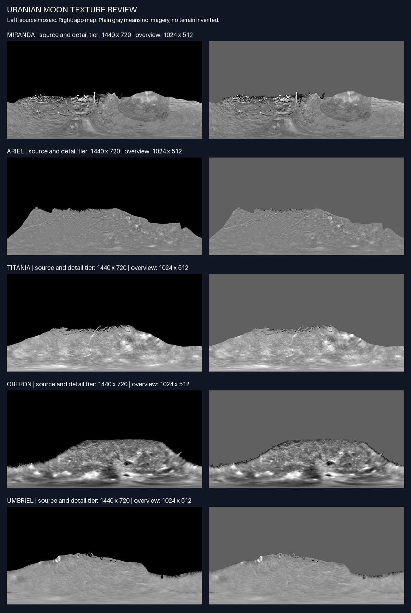

# Uranian moon imagery

Reviewed and prepared on 2026-09-21. These five diffuse maps use NASA-hosted Voyager mosaics credited **USGS/Tammy Becker & JPL/Caltech**. They show observed southern terrain and retain plain areas where this source contains no imagery. They are not complete photographic maps of the moons.



## Sources and attribution

| Body | NASA catalog | Source file used | Source dimensions | App dimensions |
| --- | --- | --- | --- | --- |
| Miranda | [NASA 3D Resources](https://science.nasa.gov/3d-resources/uranus-miranda/) | [TIFF](https://assets.science.nasa.gov/content/dam/science/cds/3d/resources/image/uranus---miranda/Uranus%20-%20Miranda.tif) | 1440 × 720 RGB | 1024 × 512 and 1440 × 720 |
| Ariel | [NASA 3D Resources](https://science.nasa.gov/3d-resources/uranus-ariel/) | [JPEG](https://assets.science.nasa.gov/content/dam/science/cds/3d/resources/image/uranus---ariel/Uranus%20-%20Ariel.jpg) | 1440 × 720 RGB | 1024 × 512 and 1440 × 720 |
| Titania | [NASA 3D Resources](https://science.nasa.gov/3d-resources/uranus-titania/) | [TIFF](https://assets.science.nasa.gov/content/dam/science/cds/3d/resources/image/uranus---titania/Uranus%20-%20Titania.tif) | 1440 × 720 RGB | 1024 × 512 and 1440 × 720 |
| Oberon | [NASA 3D Resources](https://science.nasa.gov/3d-resources/uranus-oberon/) | [TIFF](https://assets.science.nasa.gov/content/dam/science/cds/3d/resources/image/uranus---oberon/Uranus%20-%20Oberon.tif) | 1440 × 720 grayscale | 1024 × 512 and 1440 × 720 RGB |
| Umbriel | [NASA 3D Resources](https://science.nasa.gov/3d-resources/uranus-umbriel/) | [TIFF](https://assets.science.nasa.gov/content/dam/science/cds/3d/resources/image/uranus---umbriel/Uranus%20-%20Umbriel.tif) | 1440 × 720 RGB | 1024 × 512 and 1440 × 720 |

Use this credit in the app and any exported imagery using these textures:

> Voyager imagery: USGS/Tammy Becker & JPL/Caltech, via NASA 3D Resources. Resized for display; areas without imagery shown in plain gray.

Link the corresponding NASA catalog page and [NASA Images and Media Usage Guidelines](https://www.nasa.gov/nasa-brand-center/images-and-media/). NASA's guidelines explicitly cover model texture maps, permit factual educational use with acknowledgement, distinguish third-party protected material, and prohibit implied endorsement. These catalog pages identify the above credit and do not identify a separate third-party copyright restriction. This is a NASA usage-guidelines attribution, **not a CC BY license**. The app's prior Solar System Scope credit does not apply to these five maps. NASA's logo is not included.

### Source page pitfalls checked

- Miranda's page labels the downloads “Ariel,” but its actual file links point to Miranda. The TIFF was inspected for Miranda's distinctive banded terrain.
- Oberon's page links Ariel's JPEG and thumbnail. This import uses the separate **Oberon TIFF**, which has a different hash and clearly distinct cratered terrain. Do not switch to the page's JPEG without checking its identity.
- Ariel's linked TIFF returned HTTP 404 on the review date. Its correctly named JPEG is the source used here. No TIFF has been silently substituted.

## Coverage and projection

The NASA pages describe the files as planetary textures assembled from Voyager imagery. The [USGS Uranian foundational-data inventory](https://fdp.astrogeology.usgs.gov/fdp/uranus/) lists partial coverage for the major Uranian satellites; this establishes why a full-sphere image must not be interpreted as a fully photographed surface. The pixel mask produced here is a display mask, not a scientific footprint or a measurement of the photographed surface area.

Visual inspection of every downloaded source shows a large black northern region plus irregular margins around the available southern terrain. No terrain is copied, synthesized, or procedurally invented to fill it. Miranda's ridges, Ariel's fractured terrain, Titania's bright markings, Oberon's craters, and Umbriel's smoother low-contrast terrain remain distinct. Residual dark pixels at mosaic boundaries and shadows within the image are retained; the maps include source illumination and are not calibrated, shadow-free albedo products.

The 2:1 aspect ratio, pole stretching, and placement of the southern mosaic support an **equirectangular display interpretation**, with north at the image top. This is an inference from the published planetary texture layout, not complete georeferencing metadata. The NASA pages and embedded metadata do not establish longitude origin, east/west convention, or planetographic versus planetocentric latitude. The conversion applies no flip, rotation, or reprojection. These assets are suitable for visual globe display; do not place coordinate-based geological labels, infer prime-meridian orientation, or claim cartographic accuracy until a separate georeferencing check supplies those conventions.

## Reproducible preparation

The source catalog and SHA-256 locks are in [uranian-moons.sources.json](../../scripts/assets/uranian-moons.sources.json). Original downloads stay in the ignored `.uranian-sources.local/` directory and are not shipped. Exact output hashes, dimensions, byte sizes, and tool version are recorded in [uranian-moons.manifest.json](uranian-moons.manifest.json).

Use an existing Python environment containing Pillow; the reviewed build used Pillow 12.3.0. No application dependency was added. The script supports an offline output check, an offline rebuild from cached sources, and an explicit source download:

```sh
python3 scripts/assets/build_uranian_moons.py --check
python3 scripts/assets/build_uranian_moons.py
python3 scripts/assets/build_uranian_moons.py --download
```

`--download` only fetches missing sources and refuses any source whose SHA-256 differs from the lock. Byte-identical JPEG rebuilding requires the same Pillow/JPEG toolchain; the output check needs no source download and always checks against the committed hashes.

Preparation steps:

1. Verify source bytes and dimensions, then decode to RGB. Convert Oberon's grayscale TIFF to RGB without changing luminance.
2. Find the four-connected near-black region touching the top edge, requiring every RGB channel to be at most 8. This keeps disconnected dark craters/shadows intact. This deliberately conservative graphic mask can retain dark boundary pixels; it is not ground truth for observation coverage.
3. Replace only that region with uniform RGB (96, 96, 96), `#606060`. All other source pixels remain unchanged before output encoding. There is no generated terrain, sharpening, contrast adjustment, or colorization.
4. Downsample the overview variant to 1024 × 512 with Lanczos. Keep the detail variant at its **native 1440 × 720**. The `2k` directory is the existing delivery tier, not a claim that these files have 2048 pixels of source detail.
5. Encode JPEG quality 92, 4:4:4 chroma, optimized, without inherited EXIF/XMP or profiles. Runtime interpretation is sRGB. Generate the side-by-side contact sheet and output manifest.

## Integration metadata and checks

For each of `miranda`, `ariel`, `titania`, `oberon`, `umbriel`, register an overview variant at `/textures/1k/{id}_diffuse.jpg` (1024 × 512) and a detail-only variant at `/textures/2k/{id}_diffuse.jpg` (1440 × 720). Provenance is verified for source identity, credit, terms, byte hashes, and processing; geographic orientation remains limited as above. Suggested coverage text: **“Voyager photographed part of this moon. Plain gray areas have no imagery in this map.”**

The five overview files total 282,407 bytes; the five detail files total 516,539 bytes. An RGBA overview with mipmaps is approximately 2.67 MiB on the GPU; a native detail map is approximately 5.27 MiB. Load the overview maps only when needed and upgrade the selected moon only. Compressed file sizes are not GPU memory measurements.

Verified locally: all ten files decode at the declared dimensions, have distinct source/body identities, match committed hashes, and rebuild byte-identically with the recorded toolchain. The contact sheet was inspected at full size, including Miranda's terrain and Oberon's boundary. Actual globe orientation, camera framing, lighting, and device performance are integration checks for the scene implementation; asset generation alone does not establish them.
